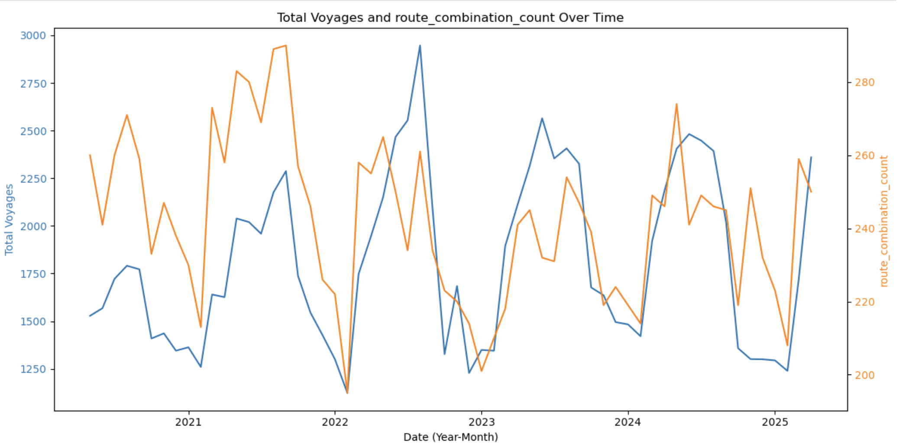
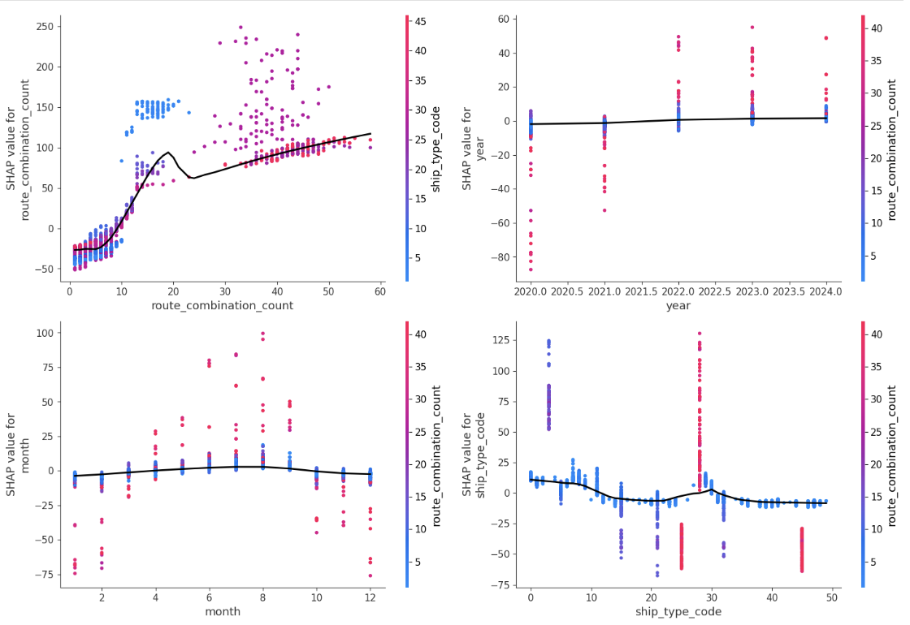

# Ocean-Meets-Forest
# 🌊 海洋與森林的交會：結合隨機森林與 SHAP 解釋之港口艘次預測系統

> 項目名稱：2025年航港大數據創意運用競賽  
> 主題標語：**航向智慧港口的新篇章**

---

## 📌 專案簡介

本專案以台中港為研究對象，運用 2020–2025 年的艘次資料，建構一套結合 **隨機森林回歸模型** 與 **SHAP 模型解釋工具** 的艘次預測與視覺化系統。

透過結合 **AI 預測力** 與 **資料科學可解釋性**，我們不僅準確預測未來艘次，亦從數據背後發掘結構性洞察，為港口資源調度與政策規劃提供支援。

---

## 🎯 專案理念：機器學習 × 統計視角的融合分析

本專案強調「模型建構」與「數據理解」的雙軌並重，不僅追求高預測準確度，更致力於從統計與圖像觀點，驗證模型邏輯與發現。

我們透過以下方式實踐這一理念：

- 📊 以**統計圖表為基礎說明模型邏輯與特徵貢獻**
- 🧠 結合 **SHAP 模型解釋** 描繪特徵影響力與預測方向
- 🌡️ 運用 **熱力圖、趨勢線圖** 等方式驗證模型輸出與真實現象一致性

本報告的核心精神在於**尊重數據與模型的相輔相成**。SHAP 在本專案中不僅是輔助工具，更是連結數據探勘與決策建議的橋梁。

---

## 🧪 方法論概覽

本系統建構在三大分析支柱之上：

| 方法         | 說明 |
|--------------|------|
| **隨機森林回歸** | 擷取歷史艘次與結構性變數，建構預測模型 |
| **SHAP 解釋模型** | 對預測結果進行全局與個別層級的貢獻分析 |
| **統計視覺驗證** | 熱力圖、趨勢線、組合數分析，驗證模型與現象一致性 |

---

## 🧩 資料來源與時間範圍

- **資料來源**：交通部航港局 iMarine 資料庫  
- **研究港口**：台中港（TWTXG）  
- **時間範圍**：2020 年 5 月至 2025 年 4 月，共五年艘次資料

---

## 🔑 關鍵變數

- **航線組合數**：預測艘次最具影響力的特徵，顯示船舶多樣性與貨物流量密切相關
- **船舶種類**：疫情期間不同船型變化顯著，為解釋艘次波動關鍵
- **月份、年份**：反映季節性與長期趨勢
- **工作日比例**：捕捉月份內作業天數變化對港口艘次的影響

---
## 📈 模型效能與驗證結果

- **隨機森林回歸 R²：0.9605**
- **SHAP Summary Plot**：清楚呈現特徵對預測結果的貢獻排序與方向
- **統計驗證圖表**：
  - 🧭 **趨勢線圖**：模型預測與真實艘次變化一致
  - 🔥 **熱力圖**：呈現船種與月份間的交互趨勢
  - 🔄 **擴增視角圖**：揭示特徵變動與預測艘次的非線性關係

---

## 💡 創新與貢獻

- 🧠 **首度將 SHAP 模型解釋應用於我國港口艘次預測任務**
- 🌉 結合 AI 預測力與統計圖像解釋，實現決策可用的模型透明化
- 📊 提供結構性視覺洞察，協助未來港口營運策略規劃與調度分析

---

## 🔗 模型部署
https://huggingface.co/spaces/jung-ming/Ocean-Meets-Forest
